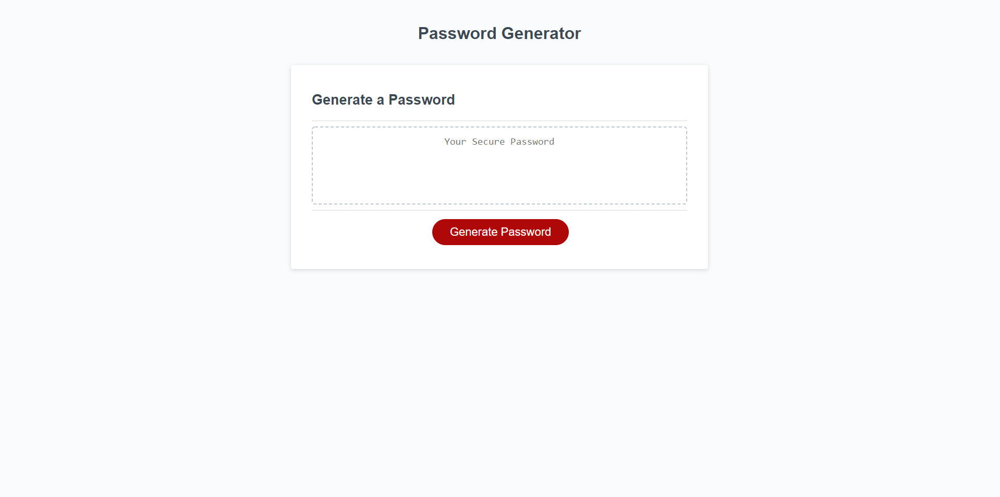

# Random Password Generator

## Description

This is a random password generator. The goal of this project was to use JavaScript to bring function to the HTML and CSS provided: a simple form with a "generate password" button and a field for the return. In order to make this work, the following tasks were required:

	1. Create a prompt to collect user choice for password length, between 8 and 128 characters.
	2. Create a series of prompts to collect user choices for character types to include: uppercase letters, lowercase letters, numbers, and/or special characters.
	3. Verify that the user's length choice fell within the given parameters and that at least one set of character types had been selected. 
	4. In the event the user's choices do NOT meet the criteria, an alert must be issued so they can make another choice.
	5. A random password, utilizing the user's choices, will be created. 
    6. The password will be written to the form on the webpage for the user to collect.
    7. Ensure that the user could use the form again right away and their previous selections would be cleared.

By meeting these goals, this webpage demonstrates several functions of JavaScript, the form's prompts are clear and simple, and the code is easy to read and understand. I learned more about working with JavaScript, multiple ways to use variables and functions, how to use alerts and prompts, and how to structure the code so it has the correct flow. One challenge was discovering there are multiple ways to achieve one goal, so it was very interesting to attempt to evaluate the best path. I am interested in learning more about this topic and to try creating a more complex generator. 
 
 

## Installation
The website is hosted by GitHub pages.  
You can find it here: [Link to Random Password Generator webpage](https://jsalexan.github.io/password-generator/)
  
The repository is on GitHub: [Link to GitHub repository for Random Password Generator project.](https://github.com/jsalexan/password-generator)  
There you will find following : index.html, README, and license files, plus an Access folder containing js and style.css files.

 

## Usage
The website (link above) was created to be used on a desktop computer. 

 

## Credits
The project team consists of the **UW Full Stack Web Development Bootcamp** instructors, teacher assistants, and students, in particular those in the Panic Problems study group. The work was reviewed prior to launch by my tutor, Cory Junier, who assisted in discussing the merits of different solutions and questions about refactoring.
 
 
**Third Party References and Tutorials used include:** 

https://developer.mozilla.org/en-US/docs/Web/JavaScript/Reference/Operators/Addition_assignment

https://www.w3schools.com/js/js_functions.asp

https://www.w3schools.com/js/js_random.asp

https://www.w3schools.com/jsref/jsref_parseInt.asp

https://www.w3schools.com/jsref/jsref_concat_string.asp

https://stackoverflow.com/questions/27037096/how-to-specify-range-on-math-random

https://stackoverflow.com/questions/39766002/how-to-unset-variable-using-javascript

https://stackoverflow.com/questions/1349404/generate-random-string-characters-in-javascript/15530287

 

## License
MIT No Attribution

Copyright 2022 Jennifer Alexander

Permission is hereby granted, free of charge, to any person obtaining a copy of this
software and associated documentation files (the "Software"), to deal in the Software
without restriction, including without limitation the rights to use, copy, modify,
merge, publish, distribute, sublicense, and/or sell copies of the Software, and to
permit persons to whom the Software is furnished to do so.

THE SOFTWARE IS PROVIDED "AS IS", WITHOUT WARRANTY OF ANY KIND, EXPRESS OR IMPLIED,
INCLUDING BUT NOT LIMITED TO THE WARRANTIES OF MERCHANTABILITY, FITNESS FOR A
PARTICULAR PURPOSE AND NONINFRINGEMENT. IN NO EVENT SHALL THE AUTHORS OR COPYRIGHT
HOLDERS BE LIABLE FOR ANY CLAIM, DAMAGES OR OTHER LIABILITY, WHETHER IN AN ACTION
OF CONTRACT, TORT OR OTHERWISE, ARISING FROM, OUT OF OR IN CONNECTION WITH THE
SOFTWARE OR THE USE OR OTHER DEALINGS IN THE SOFTWARE.

 

## Badges

